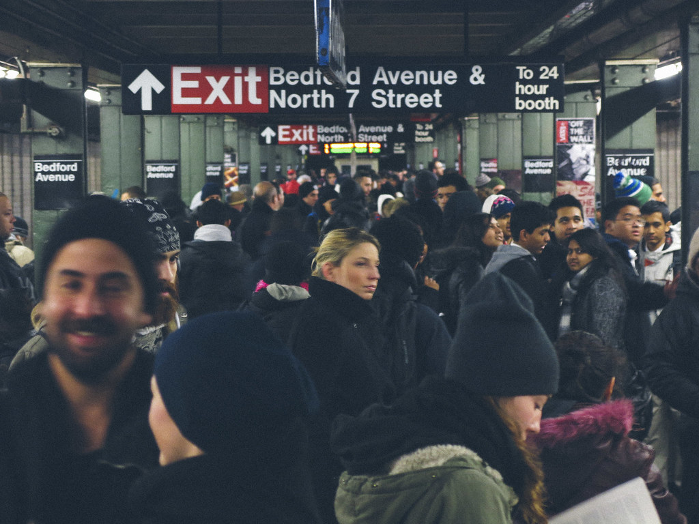
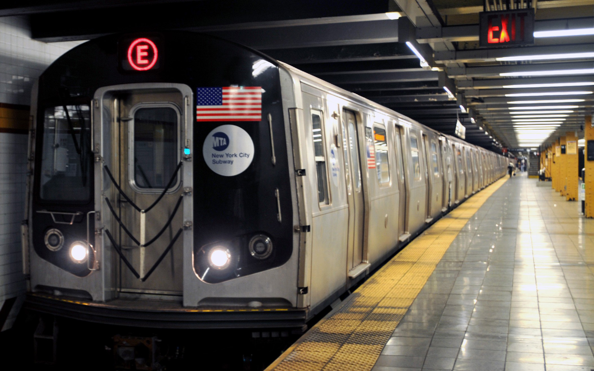
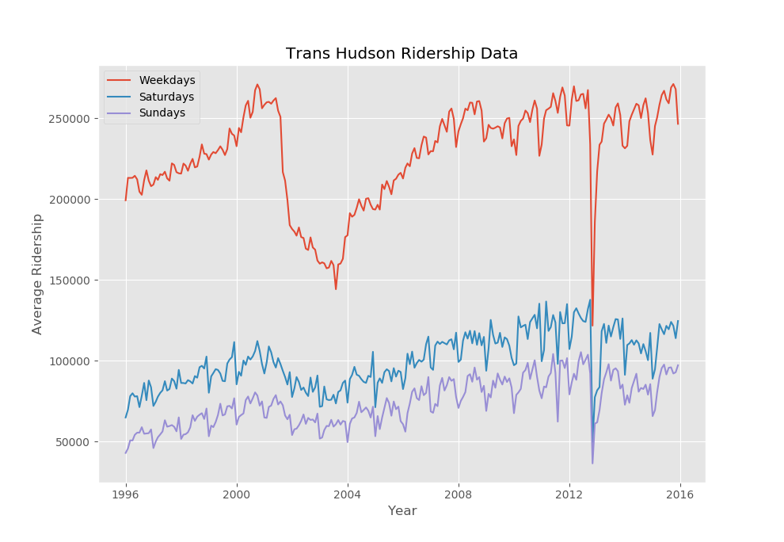
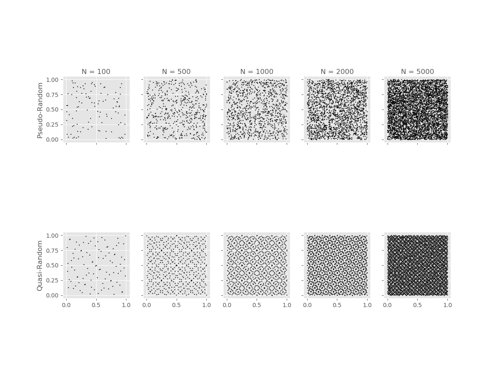

# Assignment 1 - Designing Models and Analyzing Data (Template)

> * Participant name: Simon Soschinski
> * Project Title: Dynamic Wagon Application

# General Introduction

The first part of this assignment explores designing models (and basic Python/Git features). 

We will look at **subway model in a city** system. A **subway system** is an underground, tube, or metro, underground railway system used to transport large numbers of passengers within urban and suburban areas - modern subways use different types of electronic data collection sensors to supply information which is used to manage assets and resources efficiently. 

The second part of the assignment explores data analysis. Data analysis and visualization is key to both the input and output of simulations. This assignment explores different random number generators, distributions, visualizations, and statistics. Additionally, it will look at getting you accustomed to specifying input and output variables to a system. We will also practice working with real data.

# Part 1: Designing a Model - Subway System

Every day, millions of people commute through major cities using the subway system. The amount of people traveling at a given time varies vastly throughout a day, with high peaks during the "rush hours" (getting to and from work), and even between days (e.g., weekdays vs. weekends vs. holidays). While looking at the challenge of getting those people to and from the platforms itselfs is a problem of its own 
(the escelator problem), considering the actual act of getting people off the platform and into the trains provides another task.

A subway train consists of one or more wagons, restricting the maximum amount of passengers it can cary at a time. While adding more wagons to a single train will increase the costs of running the train (e.g., more power is needed to move the extra weight), it also allows for a lagerer numbed of passengers that can be transported, adding to the value/benefits each train has. This, of course, expects a sufficiant number of passengers waiting.

The general idea of this problem and its solution/model is well known. It can be derived from the queueing problem one may also encounter in a fast food restaurant, for example. A queue will build up with customers waiting to be served (the passengers waiting for transportation). The rate with wich the queue can be processed is dependant on the lines opened (or wagons available).

On the one hand, it is in the subway operator's interest to process the waiting passengers as fast as possible. Not only can he make more revenue in a shorter time, but it will also decrease the dangers of overcrowded stations.

On the other hand, the subway operator wants to keep his costs low, avoiding unnecessary expenses.

This model provides a solution to dynamically adjust the number of wagons on a single train in order to achieve these goals.

## (Part 1.1): Requirements (Experimental Design) **(10%)**

In order to successfully solve the problem at hand, a specification of requirements is needed.

* Topic: Dynamic Wagon Application to a Subway Train
* Problem: Processing the variable amount of passengers waiting for transportation on a platform.
* Question: What is the optimal number of wagons on a single train to maximize passenger transportation while minimizing costs.
* Inputs: Number of Passengers waiting
* Output: Trainsize/Number of Wagons on next train
* Restrictions: Station/Platform capacity, Maximum (and minimum) number of wagons per train, 

## (Part 1.2) Subway Dynamic Wagon Application Model **(10%)**

* [**Object Diagram**](model/object_diagram.md) - provides the high level overview of components of the DWA Model
* [**Class Diagram**](model/class_diagram.md) - provides details of the classes of the DWA Model
* [**Behavior Diagram**](model/behavior_diagram.md) - provides details of (what are you providing details of)

## (Part 1.3) Subway Dynamic Wagon Application Simulation **(10%)**

The Dynamic Wagon Application Simulation is intended to be an discrete event simulation. At each timestep, the system will create a random number of passangers that will be added to the platform, awaiting transportation. The range of the random number will be depending on the type of time. There are three possible types:
* Normal: The random number will be within normal limits
* Rushhour: A high amount of passengers will be added
* Quiet: A smaller number then normal will be added

The platform will then send a request for a train, transmitting the current amount of passengers waiting. The train will be initialized accordingly and pick up passengers on the next timestep.

The system's output is the amount of people waiting for transportation / the wait time. A good system will have only few passangers waiting with wait times not longer then a certain amout of timesteps. Furthermore, the train capacity should not be too high, as empty trains will produce higher costs. My intention is to develop a system that will provide a good throughput and also anticipate the amount of passengers that may enter the system on the next timestep, considering the type of time.

## (Part 1.4) Subway City Dynamic Wagon Application Model **(10%)**

[**Code template**](code/README.md) - Starting coding framework for the Dynamic Wagon Application.
You are expected to create the python files - the code should run without errors, create and object(s) for your system, but not provide function detail.

## (Part 1.5) Specifying the Inputs to a System **(10%)**

* Indipendant variables
> * Time type/random amount of passengers
> * Platform capacity
> * Platform length (potentially limiting the size of train)

* Dependant variables
> * Train size
> * Passengers transported
> * Passengers waiting
> * Waittime (potentially)
> * Platform status (regarding capacity)
> * Train use of capacity

* The data will be synthetic generated data following the examination/evaltuation of similar datasets (ridership data of subway stations)
* The model will provide data that shows the optimal trainsize for specific situations (time types), allowing for a good use of capacity (no empty trains) while maximizing the throughput/minimizing the weighttime at a platform.
* The model will provide charts that suggest the optimal train sizes for the specific situations
* Since I'm not a very creative person, I'm still not sure about a "clever visualization" and am definitely open to suggestions.

# Part 2: Creating a Model from Code

## (Part 2.1) **P**ortable **O**rganic **T**rouble-free **S**elf-watering System (**POTS**) Model **(10%)**
Here [**we provide an overview**](code/POTS_system/README.md) of the **P**ortable **O**rganic **T**rouble-free **S**elf-watering System (**POTS**) Model and provide a source code template for the code found in  [**the following folder**](code/POTS_system/). Please create a **class** diagram of this model (replace the placeholder diagram). (you can use paper and pencil or a digital tool).

# Part 3: Data Analysis

## (Part 3.1) - Real Data **(10%)**

Find a datasource that looks at part of this model - subway stations locations / escalator number, heights, widths / volume of passangers - ridership numbers   (*fits* - we are pretty loose here, it can be anything.)

The Port Authority Trans Hudson dataset shows the average ridership per month for the years 1996 to 2015. The dataset is furthermore devided into the three categories Weekday, Saturday, and Sunday. As one can see from the dataset, the average ridership varies for the said categories, showing that the implementation of different passenger generator types within the Dynamic Wagon Application System makes sense.

[**Python**](code/analysis_system/) was used to calculate some basic statistic values. For example, the means for the different days were:
> * Weekdays: 228480
> * Saturdays: 100339
> * Sundays: 74069

The plot for the average ridership visualizes the data.

Another interesting aspect that comes to attention is the steep dent in late 2012.

## (Part 3.2) -  Plotting 2D Random Number Generators **(15%)**

This portion of the assignment looks at generating random numbers in Python and understanding how to properly plot them. Plot two different random numbers, pseudo random and quasi random, for five different N values. There should be 10 subplots, all properly formatted 2D plots. Note, each of the N points will have two coordinates, an x and a y, therefore you will need to generate two random numbers for each point. You should replace the image with your results in a simalar format. Discuss how the patterns differ. Feel free to change the N values from the suggested N values in the image to state your case.

As discussed in class, the pseudo random numbers seem to be more "actually random", whereas the quasi random numbers are more evenly distributed. With a sufficient large enough N, both generators fill the whole spectrum of available numbers.

## (Part 3.3) -  Plotting 1D Random Distributions **(15%)**

Now, choose three different distributions to plot in 1D, or as a histogram. Choose a pseudo-random generator and generate three different distributions. Example distributions are Uniform (part 8), Normal, Exponential, Poisson, and Chi-Squared, but feel free to use any three distributions of your choice. Again, plot each distribution for five different Ns. This will result in 15 different subplots, formatted similar to the image in Part 8. Include your properly formmated 1D plots below and breifly describe what we are looking at and how things change as N is changed.

Repeat the above using a quasi-random generator. Discuss the similarities and differences.
