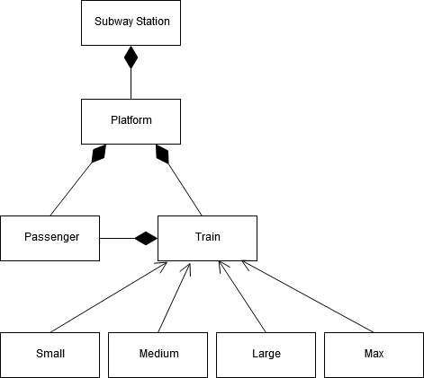

## Smart City Dynamic Wagon Application Model - Object Diagram

The Dynamic Wagon Application Model (DWA Model) describes how variable sized trains are used to proceed/transport fluctuating amounts of passengers waiting at a subway station.

A subway station consists of one or more platforms.

Each platform has a number of passengers waiting for transportation and a train to accomplish that.

A train can be of a predefined size (Small, Medium, Large or Max), allowing for a maximum amount of people riding it.
